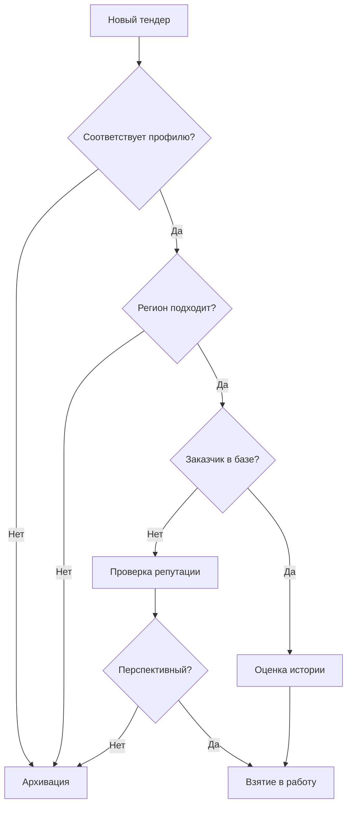

# **Бизнес-процесс: Участие в тендерах на медицинское оборудование**

### **📋 Общая информация**

| Параметр | Описание |
|----------|----------|
| **Цель** | Системная подготовка и подача конкурентоспособных предложений для победы в тендерах |
| **Участник** | Специалист по тендерам / Менеджер по закупкам |
| **Длительность** | От 3 до 14 дней в зависимости от сложности тендера |
| **Ключевые метрики** | Процент побед, срок подготовки, точность спецификации |

---

## **🔍 Этап 1: Мониторинг и отбор тендеров**

### **Что делаем:**
Ежедневный скрининг новых тендеров в системе «ТендерВин» и на электронных площадках.

### **Критерии отбора:**


**Результат:** Приоритизированный список тендеров для участия.

---

## **📝 Этап 2: Глубокий анализ ТЗ и формирование спецификации**

### **2.1 Анализ технического задания**

**Инструмент:** Рабочая таблица анализа ТЗ

| № позиции | Наименование по ТЗ | Тип требования | Риски | Статус |
|-----------|-------------------|----------------|-------|--------|
| 1 | Аппарат ИВЛ Dräger Savina 300 | Жесткое | Высокая цена | Оригинал |
| 2 | Дефибриллятор-монитор | Мягкое | Конкуренция | Подбор аналога |
| 3 | ... | ... | ... | ... |

**Классификация требований:**

| Тип | Как определить | Возможность замены |
|-----|----------------|-------------------|
| **Жесткие** | Конкретная модель, уникальный параметр, специальный сертификат | Только оригинал |
| **Мягкие** | Описание функций, класс оборудования, общие характеристики | Аналог допустим |

### **2.2 Поиск оборудования**

**Процесс поиска:**
```
Требование → Проверка базы поставщиков → Найден? → Да → Валидация
                                          ↓ Нет
                                          Поиск аналогов → Сравнение → Выбор
```

**Чеклист валидации оригинала:**
- [ ] Действующее РУ в реестре Росздравнадзора
- [ ] Модель не снята с производства
- [ ] Русскоязычная комплектация
- [ ] Наличие сервисной поддержки

### **2.3 Подбор аналогов**

**Матрица сравнения аналогов:**

| Параметр | Требование ТЗ | Оригинал | Аналог 1 | Аналог 2 |
|----------|---------------|----------|----------|----------|
| Производитель | - | Dräger | Philips | Mindray |
| Основная функция | ИВЛ для взрослых | + | + | + |
| Режимы вентиляции | ≥ 5 | 7 | 6 | 8 |
| РУ | Действующее | + | + | + |
| Гарантия | 24 месяца | 24 | 24 | 36 |
| **Цена (ориентир)** | - | 1 500 000 ₽ | 1 200 000 ₽ | 900 000 ₽ |

**Принятие решения:**
```python
if (соответствует_ТЗ and есть_РУ and цена_конкурентна):
    выбираем_аналог()
elif (оригинал_единственный_вариант):
    работаем_с_оригиналом()
else:
    отказываемся_от_позиции()
```

---

## **📧 Этап 3: Запрос коммерческих предложений**

### **Шаблон запроса поставщику:**
```
Тема: Запрос КП по тендеру [№] от [Дата]

Уважаемый поставщик!

Просим предоставить коммерческое предложение на следующие позиции:

1. [Наименование], [Модель]
   • Количество: [шт]
   • Требования: [ссылка на ТЗ]
   • Срок поставки: [макс. количество дней]

Условия:
- Цена с учетом всех налогов
- Наличие на складе РФ
- Действующее РУ и полный пакет документов
- Гарантия и сервис

Срок предоставления КП: до [Дата]

С уважением,
[Должность, Контакты]
```

### **Обработка ответов:**

**Типовые сценарии:**

| Ответ поставщика | Действия | Приоритет |
|------------------|----------|-----------|
| ✅ Положительный с КП | Внесение в таблицу сравнения | Высокий |
| ⏱ Уточнение сроков | Маркировка как "рисковая" | Средний |
| ❌ "Тендер не за вами" | Анализ, решение об участии | Критично |
| 📄 Запрос доп. информации | Быстрое уточнение | Высокий |

---

## **✅ Этап 4: Анализ КП и выбор поставщиков**

### **Оценочная таблица:**

| Поставщик | Цена | Наличие | Срок | РУ | Гарантия | Итоговый балл |
|-----------|------|---------|------|----|----------|---------------|
| Поставщик А | 1.2M ₽ | На складе | 10 дней | ✅ | 24 мес | 9.2 |
| Поставщик Б | 1.1M ₽ | Под заказ | 30 дней | ✅ | 12 мес | 7.8 |
| Поставщик В | 1.3M ₽ | На складе | 7 дней | ✅ | 36 мес | 8.5 |

**Формула оценки:**
```
Итоговый балл = (Цена × 0.4) + (Наличие × 0.3) + (Срок × 0.2) + (Документы × 0.1)
```

---

## **📄 Этап 5: Формирование заявки**

### **Чеклист документов:**

**Обязательные документы:**
- [ ] Заполненная форма заявки
- [ ] Коммерческое предложение (оригинал)
- [ ] Копии РУ на все позиции
- [ ] Сертификаты соответствия
- [ ] Гарантийные письма
- [ ] Доверенности (при необходимости)

**Дополнительные (если требуется):**
- [ ] Обоснование аналогов
- [ ] Сертификаты СМК
- [ ] Финансовая документация

### **Контроль качества перед отправкой:**
```
1. Проверка реквизитов
2. Сверка всех цифр
3. Полнота пакета документов
4. Соответствие форматам
5. Тайминг отправки (не в последнюю минуту)
```

---

## **🎯 Этап 6: Подача и анализ результатов**

### **Процесс подачи:**
```
Подготовка → Тестовая отправка → Финальная отправка → Подтверждение → Мониторинг
```

### **Анализ результатов:**

**Шаблон отчета по тендеру:**

```markdown
# Итоги тендера [Номер]

**Дата:** [Дата проведения]
**Заказчик:** [Название организации]
**Наша позиция:** [Место в рейтинге]
**Результат:** Победа/Проигрыш

## Ключевые цифры:
- Наша цена: [Сумма] ₽
- Цена победителя: [Сумма] ₽
- Разница: [Процент] %

## Анализ причин:
✅ Что сделали хорошо:
- [Сильная сторона 1]
- [Сильная сторона 2]

❌ Что можно улучшить:
- [Область улучшения 1]
- [Область улучшения 2]

## Выводы:
[Основной вывод и рекомендации на будущее]
```

---

## **📊 Метрики и улучшения**

### **KPI процесса:**

| Метрика | Цель | Текущее значение |
|---------|------|------------------|
| Процент побед | > 30% | [ ]% |
| Среднее время подготовки | < 5 дней | [ ] дней |
| Точность спецификации | 100% | [ ]% |
| Количество ошибок в заявках | 0 | [ ] |

### **База знаний для улучшений:**
1. **Успешные аналоги** - каталог проверенных замен
2. **История цен** - динамика по поставщикам
3. **Шаблоны документов** - быстрые шаблоны для типовых тендеров
4. **Контакты ответственных** - база контактов заказчиков

---

## **🚨 Управление рисками**

| Риск | Вероятность | Влияние | Меры предотвращения |
|------|-------------|---------|---------------------|
| Отсутствие РУ | Средняя | Высокое | Предварительная проверка до запроса КП |
| "Заточенный" тендер | Высокая | Критичное | Ранний анализ формулировок ТЗ |
| Срыв сроков поставки | Средняя | Высокое | Работа только с проверенными поставщиками |
| Ошибки в документах | Низкая | Критичное | Двойная проверка и чеклисты |

---

Этот визуализированный процесс показывает не только последовательность действий, но и инструменты, критерии принятия решений и точки контроля на каждом этапе. Такой формат делает процесс понятным для новых сотрудников и удобным для анализа эффективности.
